# 漫画でわかるストア哲学入門

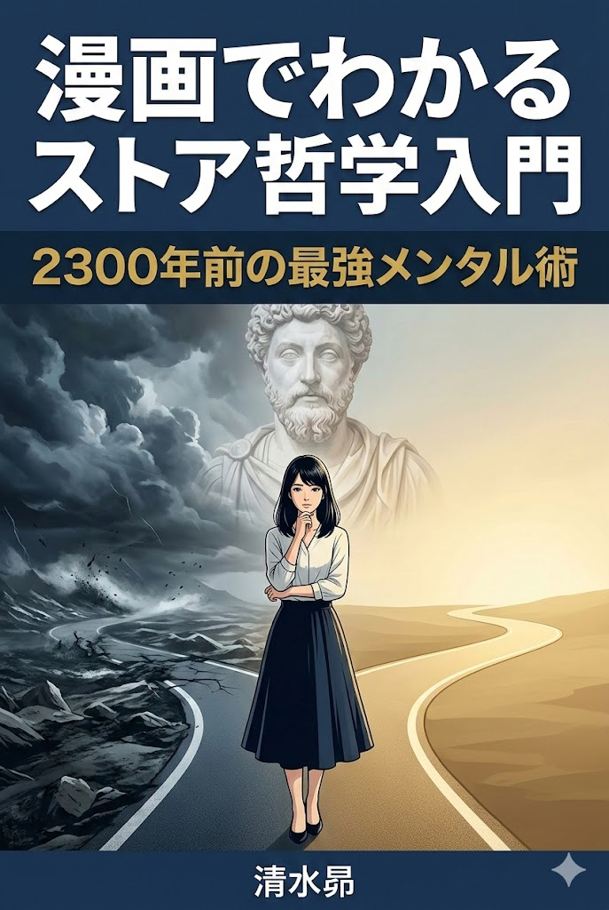{ width=100% }

## はじめに

「ストア哲学」という言葉を聞いて、どんなイメージが浮かびますか。

「感情を殺して、ロボットのように生きる哲学」「何があっても我慢する修行僧のような教え」——もしそう思われたなら、それは大きな誤解です。そして、この誤解こそが本書を書いた理由のひとつです。

ストア哲学は、約2300年前の古代ギリシャで生まれました。しかし今、シリコンバレーの起業家からプロアスリート、メンタルヘルスの専門家まで、世界中の第一線で活躍する人々がこの古代の哲学を日常に取り入れています。TikTokでは「#stoicism」のハッシュタグが25億ビューを超え、Z世代の間でも急速に広まっています。

なぜ2000年以上前の哲学が、今これほど求められているのでしょうか。

答えはシンプルです。私たちが抱えている悩みの本質は、2000年前とほとんど変わっていないからです。上司の理不尽な態度に怒りを感じる。SNSの批判コメントに傷つく。将来への不安で眠れない夜がある。こうした悩みに対して、ストア哲学は驚くほど具体的で、実践的な「処方箋」を持っています。

本書では、ストア哲学の三大哲学者——奴隷から哲学者になったエピクテトス、ローマ帝国の政治家セネカ、そして哲人皇帝マルクス・アウレリウス——の生涯と教えを、漫画と図解でわかりやすくお伝えします。

本書を読み終える頃には、次の2つの「誤解」が完全に解消されているはずです。

- 「ストア哲学は感情を殺す哲学」ではなく、感情に振り回されずに生きる技術であること
- 「運命を受け入れる＝あきらめる」ではなく、自分の力が届く場所に全力を注ぐ哲学であること

難しい哲学用語はできるだけ使わず、現代の職場やSNS、人間関係のシーンに当てはめながら解説していきます。1日5分から始められる実践法も紹介していますので、読んだその日から「ストア的な生き方」を試してみてください。

それでは、2300年の時を超えた知恵の旅へ、一緒に出かけましょう。

\newpage

## 第1章 ストア哲学とは何か — 2300年前の「最強メンタル術」

{ width=100% }

\newpage

### 1.1 ゼノンの難破船 — すべてはここから始まった

紀元前300年頃のこと。フェニキア出身の商人ゼノンは、地中海を航行中に嵐に遭い、船もろとも積荷のすべてを失いました。一文無しでアテナイ（現在のアテネ）の港に漂着した彼は、失意のどん底にありました。

しかし、ゼノンの人生はここから大きく転換します。アテナイの書店でソクラテスについての本を手に取り、哲学に出会ったのです。彼はその場で書店の主人に尋ねました。「こういう人物にはどこで会えるのですか」と。

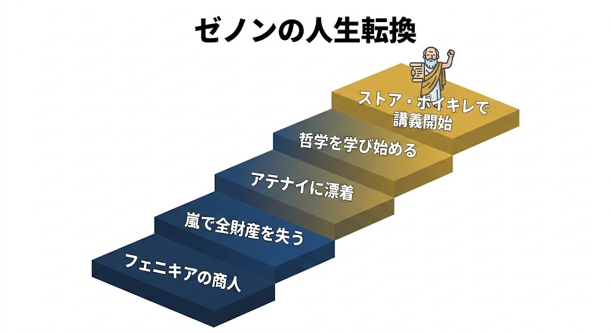{ width=100% }

ゼノンはその後、アテナイで哲学を学び、やがて自らの学派を立ち上げます。講義の場所に選んだのが「ストア・ポイキレ（彩色柱廊）」という公共の回廊でした。「ストア哲学」という名前は、この回廊の名前に由来しています。つまりストア哲学は、全財産を失った男が、ゼロから築き上げた「逆境を生き抜く知恵」なのです。

ここに、ストア哲学の最初のメッセージがあります。「外側の状況がどれほど悲惨でも、内側の心の持ち方は自分で選べる」。ゼノン自身が、その証明でした。

\newpage

### 1.2 4つの徳 — ストア哲学の羅針盤

ストア哲学には、人生のあらゆる判断の基準となる「4つの徳（アレテー）」があります。これはストア哲学の羅針盤であり、すべての教えはこの4つの徳に行き着きます。

{ width=100% }

**知恵（ソフィア / プロネーシス）**は、物事の善悪を正しく判断する能力です。「今の自分にとって本当に大切なことは何か」を見極める力とも言えます。現代に置き換えると、SNSの炎上に反射的に反応するのではなく、「これは自分が関わるべきことか」と立ち止まって考える力です。

**勇気（アンドレイア）**は、困難に正しく向き合う力です。ただし、ストア哲学で言う勇気は「恐怖を感じない」ことではありません。恐怖を感じながらも、正しいと思うことを実行する力です。職場で不正を見つけた時に声を上げる、自分の意見を率直に伝える——そうした日常の場面で発揮される勇気です。

**節制（ソフロシュネー）**は、欲望や衝動を理性でコントロールする力です。「もっと欲しい」「今すぐ手に入れたい」という衝動に対して、「本当に必要か」と問いかける習慣です。衝動買いを我慢することから、怒りに任せてメールを送らないことまで、幅広い場面で使えます。

**正義（ディカイオシュネー）**は、他者に対して公正に行動する力です。ストア哲学者たちは、人間は社会的な存在であり、他者への貢献なくして良い人生はないと考えました。自分だけが得をすればいいのではなく、コミュニティ全体にとっての善を考える姿勢です。

この4つの徳は、どれか1つだけを極めればいいというものではありません。4つがバランスよく機能することで、どんな状況でも「正しい判断」ができるようになります。迷った時には「この選択は4つの徳のどれに沿っているか」と自分に問いかけてみてください。

\newpage

### 1.3 アパテイアの真実 — 「感情を殺す」は最大の誤解

ストア哲学について最もよくある誤解が、「感情を殺す哲学」というものです。この誤解は「アパテイア」という概念の誤訳から生まれました。

アパテイアは英語の「apathy（無気力・無関心）」の語源ですが、ストア哲学での意味はまったく異なります。アパテイアとは「パトス（激しい欲情・破壊的な衝動）に支配されない状態」を指します。感情がゼロの状態ではなく、**感情に振り回されない状態**です。

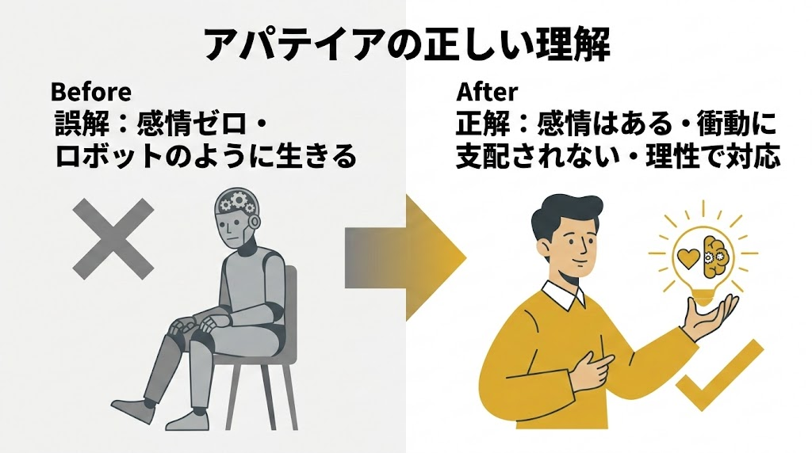{ width=100% }

たとえば、友人が亡くなったときに悲しむのは自然なことであり、ストア哲学はそれを否定しません。しかし、その悲しみに何か月も支配されて日常生活が送れなくなるのは、パトスに囚われた状態です。悲しみを感じつつも、自分の役割を果たし続ける——それがアパテイアです。

セネカは妻への手紙の中でこう書いています。「私は涙を禁じはしない。しかし涙に支配されることは許さない」と。この一文が、アパテイアの本質を最もよく表しています。

現代の心理学では、これを「感情の調整（Emotion Regulation）」と呼びます。認知行動療法（CBT）の基本原理——「出来事そのものではなく、出来事についての解釈が感情を生む」——は、実はストア哲学のエピクテトスの教えが直接の源流です。2000年前の哲学が、現代の科学的な心理療法の基盤になっているのです。

怒りを例に取りましょう。職場で理不尽なことを言われた時、怒りの感情が湧くのは自然な反応です。ストア哲学が問題にするのは、その怒りに任せて怒鳴り返したり、机を叩いたり、メールで攻撃的な文面を送ったりすることです。怒りを感じた瞬間に「この怒りは、自分のコントロール下にあることに対する怒りか、それとも支配外のことに対する怒りか」と問いかける。この一瞬の間が、衝動的な行動を防いでくれます。

ストア哲学は感情を消す教えではありません。感情を感じながらも、理性の手綱を離さない技術です。

\newpage

## 第2章 三人の哲学者 — 奴隷、政治家、皇帝が同じ答えにたどり着いた

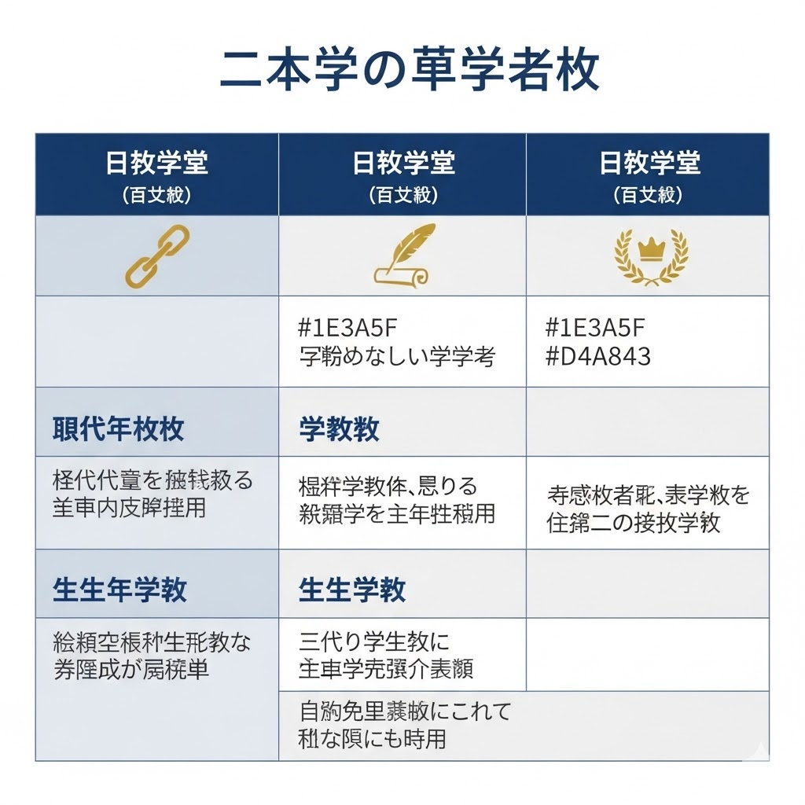{ width=100% }

ストア哲学の最も興味深い点のひとつは、その代表的な三人の哲学者の「境遇の違い」です。一人は奴隷、一人は帝国の政治家、一人はローマ皇帝。社会的地位がこれほどかけ離れた三人が、同じ哲学的結論にたどり着いたという事実は、ストア哲学が「どんな立場の人にも使える普遍的な知恵」であることを証明しています。

\newpage

### 2.1 エピクテトス — 奴隷から最も自由な人間へ

エピクテトス（50年頃〜135年頃）は、小アジア（現在のトルコ）のヒエラポリスで奴隷として生まれました。主人のエパフロディトスはローマ皇帝ネロの秘書官でしたが、暴力的な人物で、ある時エピクテトスの足をねじり上げて骨を折ったと伝えられています。

この時エピクテトスは、痛みに耐えながらこう言ったとされています。「足を折ろうとしていますね」。そして実際に折れた後、「言ったでしょう、折れましたよ」と静かに告げたというのです。

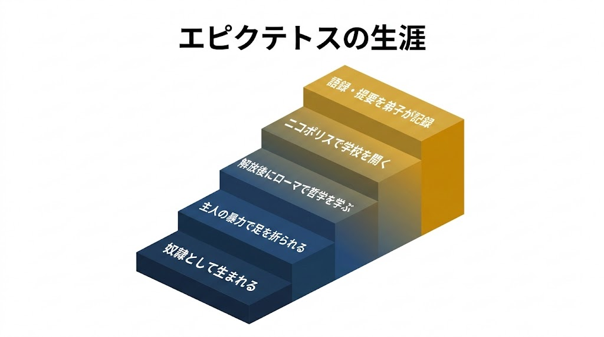{ width=100% }

この逸話が事実かどうかはさておき、エピクテトスの教えの核心が凝縮されています。「身体は自分のものではない（支配外）。しかし、その状況にどう反応するかは自分で選べる（支配下）」。奴隷という究極の不自由の中で、彼は内面の自由を発見したのです。

やがて解放されたエピクテトスは、ローマで哲学を学び、後にギリシャのニコポリスで学校を開きました。彼自身は一冊も本を書いていません。弟子のアリアノスが講義を記録した「語録（ディスクールス）」と、その要約版「提要（エンキリディオン）」が、今に伝わる彼の教えのすべてです。

エピクテトスの最大の貢献は「コントロール二分法」の体系化です。「提要」の冒頭の一文——「ものごとには、われわれの支配下にあるものと、支配下にないものとがある」——は、ストア哲学の全教えをたった一文に凝縮したものと言えます。

現代の私たちにとってエピクテトスの存在が特に意味を持つのは、「最も不利な状況にあった人間が、最も自由な精神を手に入れた」という逆説です。あなたが今どんな状況にいても、内面の自由は奪えない。それがエピクテトスのメッセージです。

\newpage

### 2.2 セネカ — 権力の渦中で哲学を貫いた政治家

ルキウス・アンナエウス・セネカ（紀元前4年頃〜65年）は、エピクテトスとは正反対の立場にいました。裕福な家庭に生まれ、ローマ帝国の元老院議員として出世し、後に暴君ネロの教育係・顧問として帝国の中枢で権力をふるいました。

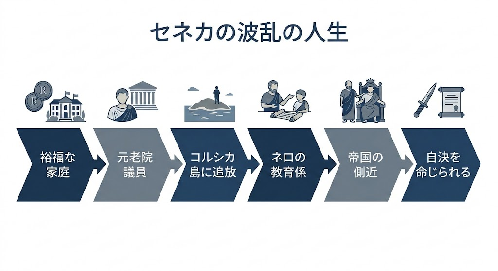{ width=100% }

しかしセネカの人生は順風満帆ではありませんでした。皇帝クラウディウスの怒りを買い、コルシカ島に8年間追放されます。その後ネロの母アグリッピナに呼び戻され、若きネロの教育係を務めました。ネロの治世初期は「五年間の善政」と呼ばれるほど安定していましたが、やがてネロは暴虐な支配者へと変貌していきます。

65年、ネロへの陰謀に関与したという嫌疑をかけられ（実際の関与は不明）、セネカは自決を命じられました。その最期の場面は、歴史家タキトゥスによって詳細に記録されています。セネカは友人たちに「私が残す最も美しい遺産は、私の生き方の姿だ」と告げ、静かに血管を開いたのです。

セネカの著作は驚くほど実践的です。「人生の短さについて」では、「人生は短いのではなく、我々がそれを短くしているのだ」と喝破しました。「怒りについて」では、怒りの感情が生まれてから爆発するまでのプロセスを分析し、その各段階での対処法を具体的に示しました。

彼が友人ルキリウスに宛てた124通の「道徳書簡」は、ストア哲学の最も読みやすい入門書として今も愛読されています。日常の具体的な場面——食事、旅、友人関係、老い——を題材にしながら、そこにストア哲学の原理をさりげなく織り込む手法は見事です。

セネカが現代の私たちに教えてくれるのは、「完璧なストア哲学者でなくてもいい」ということです。彼自身、莫大な富を持ち、権力の世界に身を置きながら、「質素に生きよ」と説く矛盾を批判されました。しかし彼は「私は完璧ではない。しかし完璧を目指す旅の途上にいる」と応じました。理想と現実の間で葛藤しながらも、哲学を手放さなかった——その姿こそが、私たちの手本になります。

\newpage

### 2.3 マルクス・アウレリウス — 哲人皇帝の孤独な日記

マルクス・アウレリウス（121年〜180年）は、ローマ帝国の「五賢帝」の最後の一人です。「哲人皇帝」の異名を持つ彼は、ストア哲学の実践者として、そして世界史上最も権力を持った哲学者として知られています。

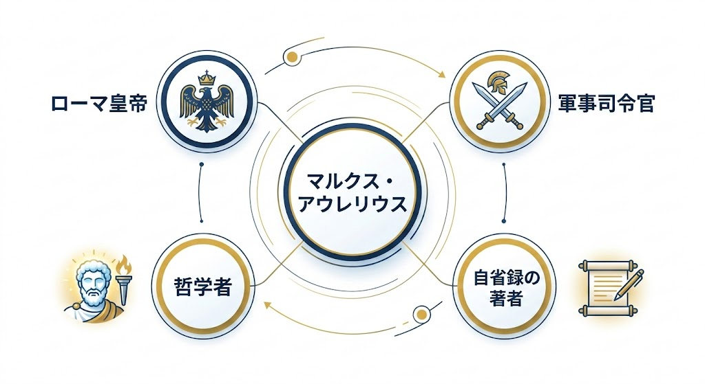{ width=100% }

マルクスは恵まれた環境に生まれ、最高の教育を受けました。12歳で哲学に興味を持ち、粗末な外套をまとって床で寝るという禁欲的な生活を自ら選んだと伝えられています（母親に説得されてベッドに戻ったそうですが）。

161年に皇帝に即位しましたが、その治世は苦難の連続でした。ゲルマン民族の侵攻、パルティアとの戦争、帝国全土を襲った疫病（アントニヌスの疫病）、信頼していた将軍カッシウスの反乱——次々と押し寄せる危機の中で、マルクスは前線の軍営テントの中で、自分自身に向けた思索のノートを書き続けました。

このノートが「自省録（タ・エイス・ヘアウトン＝自分自身に向けて）」です。出版を意図して書かれたものではなく、完全に個人的な日記でした。だからこそ、そこには飾りのない、生々しい言葉が綴られています。

「朝、起きたくないと思ったら、自分にこう言い聞かせよ。『私は人間としての仕事をするために起きるのだ』」。世界最大の帝国の皇帝が、朝起きるのが辛いと正直に書いている。この率直さが、2000年後の読者の心にも響きます。

マルクスはこうも書きました。「あと少しすれば、お前はすべてを忘れるだろう。そしてあと少しすれば、すべてがお前を忘れるだろう」。権力の頂点にいながら、自分の有限性と宇宙の広大さを常に意識していた。それが彼の強さの源泉でした。

\newpage

### 2.4 三人に共通する「たった一つの問い」

奴隷、政治家、皇帝。立場はまったく異なりますが、三人に共通する問いがあります。

「この状況で、自分にできることは何か」

エピクテトスは鎖につながれた身体の中で、セネカは権力闘争の渦中で、マルクスは疫病と戦争が同時に襲う帝国の最前線で、同じ問いを自分に投げかけ続けました。

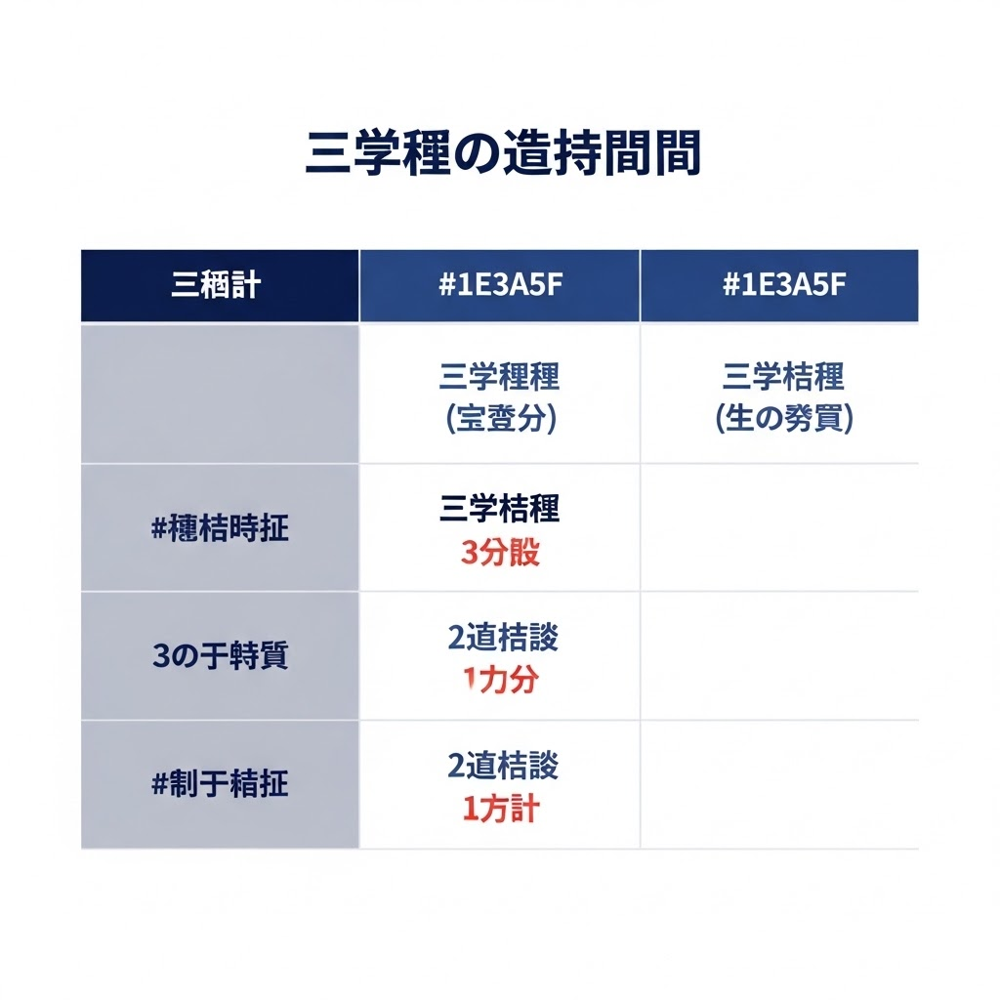{ width=100% }

この共通性こそが、ストア哲学の普遍性を証明しています。社会的地位も、時代も、環境も関係ない。人間が「自分にできることに集中する」という選択をできる限り、ストア哲学は機能します。

あなたが会社員でも、フリーランスでも、学生でも、子育て中の親でも同じです。今この瞬間、あなたの支配下にあることは何でしょうか。その問いに答えることが、ストア哲学を生きることの第一歩です。

\newpage

## 第3章 コントロール二分法 — 悩みの9割を手放す技術

{ width=100% }

\newpage

### 3.1 「変えられること」と「変えられないこと」を分ける

「どうしてあの上司は私のことをわかってくれないのだろう」「なぜあの人は私を嫌うのだろう」——毎日のように、そんな問いが頭を占領していませんか。ストア哲学の最初の教えは、この悩みの構造そのものを解体するところから始まります。

エピクテトスは奴隷として生まれ、足を折られるほどの暴力も経験した人物です。しかし彼は、ローマ帝国でもっとも尊敬される哲学者のひとりになりました。その思想の核心は、著書「提要（エンキリディオン）」の冒頭のたった一文に凝縮されています。「ものごとには、われわれの支配下にあるものと、支配下にないものとがある」。

これが「コントロール二分法」です。シンプルに聞こえますが、この仕分けを本当に身体に染み込ませると、悩みの総量が劇的に減ります。

自分の支配下にあるもの、すなわちコントロールできるものは、**自分の判断・行動・価値観・意見**です。今この瞬間に何を考えるか、どう行動するか、何を大切にするか——これらはどんな状況でも自分が最終的に決定できる領域です。エピクテトスはこれを「われわれにかかること（エフ・ヘーミン）」と呼びました。

一方で支配下にないもの、コントロールできないものは、**身体の状態・評判・財産・他者の行動・過去・天気・社会情勢**など、外部にあるすべてです。どれだけ努力しても、他者があなたをどう評価するかを完全にコントロールすることはできません。株価が下がること、電車が遅延すること、病気になることも、最終的には自分の支配外にあります。

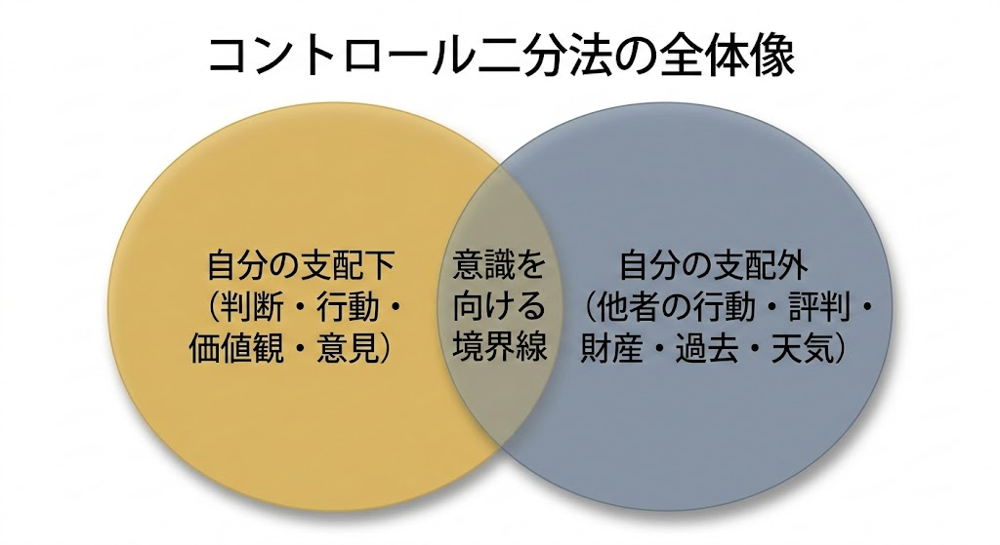{ width=100% }

ここで重要なのは、「支配外のものに悩むのは無駄だ」と言いたいわけではありません。問題は、支配外のことを「なんとかしようと思って力を注ぎ続けること」です。他者の心を変えようと必死になったり、すでに起きた過去を悔やみ続けたりすることに膨大なエネルギーを使う。その間、本当に変えられる「自分の行動」から目が離れてしまうのです。

エピクテトスの言葉を借りれば、「われわれが苦しむのは、ものごとそのものによってではなく、ものごとについてのわれわれの判断によってである」となります。悩みの源泉は外側の出来事ではなく、その出来事に対して自分がどんな意味づけをするかです。つまり、**出来事は変えられなくても、出来事への向き合い方は変えられる**——ここにコントロール二分法の本質があります。

\newpage

### 3.2 職場で使うコントロール二分法

理論はわかった、でも実際の職場でどう使えばいいのか。具体的なシーンで考えてみましょう。

**シーン1: 上司に怒鳴られた朝**

月曜日の朝、提出した企画書に対して上司から「これじゃ全然ダメだ」と、みんなの前で厳しい言葉を浴びせられました。午後の会議まで頭の中をその言葉がぐるぐると回り続けます。「なぜあんな言い方をするのか」「私の仕事は本当にダメなのか」「周りはどう思っただろうか」。

ここでコントロール二分法を使います。まず頭の中にあるすべての要素を書き出し、仕分けします。

「自分の支配外」に入るもの: 上司が怒鳴ったという事実、上司の言い方・感情、その場にいた同僚の目、上司が今後どう評価するか——これらはすべて他者の行動や感情であり、自分では直接変えられません。

「自分の支配下」に入るもの: 企画書の内容を見直す、上司に個別で「改善点を具体的に教えてください」と聞きに行く、次の企画書に向けてリサーチをする、今の自分の感情（怒りや悲しみ）とどう向き合うかを選ぶ——これらは自分が今すぐ動けることです。

コントロール二分法は「上司の怒鳴り方は仕方ない」と諦めるためのツールではありません。そうではなく、「エネルギーを向けるべき場所はどこか」を明確にするためのツールです。上司の感情を変えようと悩む時間を、企画書の品質を上げる行動に変換する——それが実践です。

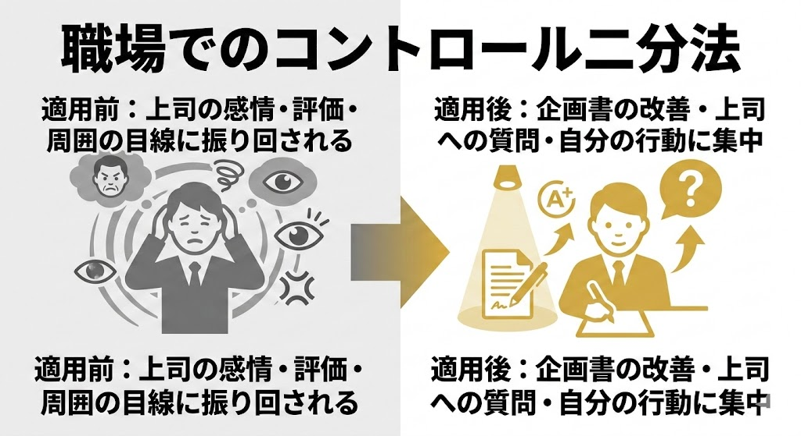{ width=100% }

**シーン2: 理不尽な人事評価**

半年間、成果を出すために全力を尽くしたのに、査定は「C評価」でした。同期のBさんはこれといった実績がないのに「B評価」。モチベーションが一気に崩れ、「もうここでは頑張っても意味がない」という気持ちが押し寄せてきます。

支配外: 上司が下した評価、会社の評価基準、Bさんがなぜ高い評価を受けたか。

支配下: 次の評価期間に向けて何を改善するか、上司に評価の理由を聞いて正確な基準を把握する、このまま同じ会社にいるかどうかを考える（転職含め）、自分の仕事の質をどう定義するかという内なる価値基準。

ここで「評価が不当だ」という感情はあって当然です。ストア哲学は感情を否定しません。大切なのは、その感情に引きずられてパフォーマンスが落ちたり、健康を崩したりすることを避けることです。感情を感じつつも、行動は「支配下にあること」に向け直す——そのための道具としてコントロール二分法を使います。

\newpage

### 3.3 SNS・人間関係で使うコントロール二分法

SNSは現代においてコントロール二分法が最も試される場所のひとつです。ある調査によると、Z世代の50%以上がSNSによる不安やうつの症状を経験したことがあると報告しています。その背景には、「いいね数」「フォロワー数」「コメントの反応」という、本質的に他者の行動に依存した指標を、自分の価値の基準にしてしまう構造があります。

**シーン3: 批判コメントと数字の増減**

丁寧に書いたSNS投稿に「これは違うと思います」という批判コメントがつきました。また昨日から今日にかけてフォロワーが20人減っています。どちらも、気になって仕方がない。

支配外: 他者がコメントをするかどうか、コメントの内容、フォロワーが増えるか減るか、投稿がどれだけ拡散されるか——すべて他者の行動です。

支配下: 投稿する内容・頻度・クオリティへの工夫、批判コメントに対してどう返答するか（あるいは返答しないか）、批判の内容に学ぶ点があれば取り入れる判断、SNSを使う目的を自分で再定義する。

エピクテトスが生きていたとしたら、こう言うでしょう。「フォロワーの数はあなたの支配下にない。しかしあなたが誠実な言葉で発信し続けるかどうかは、完全にあなたの支配下にある」と。

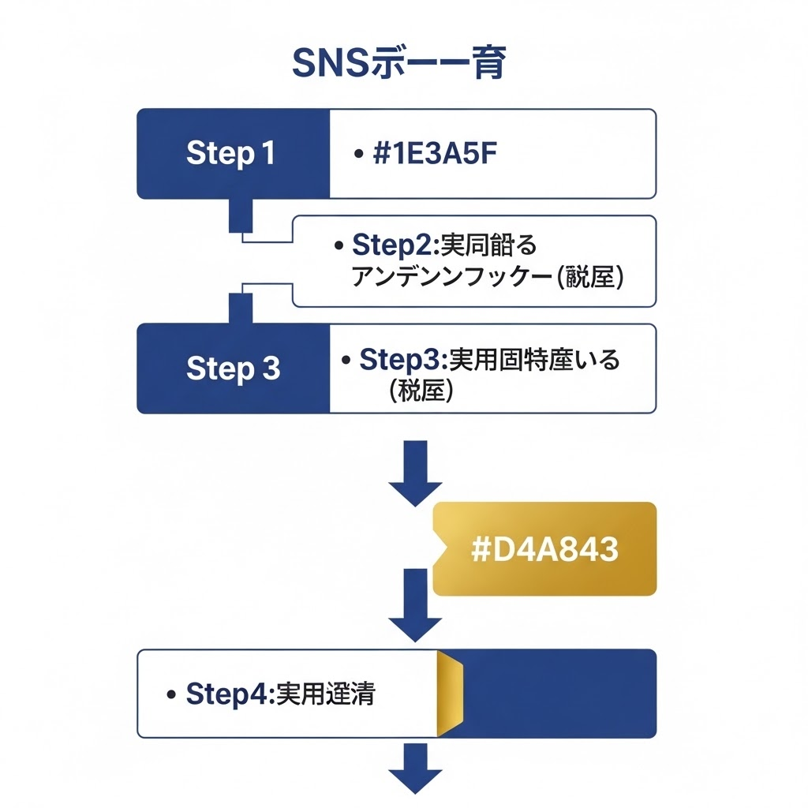{ width=100% }

**シーン4: 友人の裏切りと恋人との価値観の相違**

長年の友人が、自分の秘密を第三者に話していたことがわかりました。また、交際中のパートナーとの間に、仕事と家庭の優先順位について根本的な価値観の違いがあることに気づき、どうすればいいかわからなくなっています。

こうした人間関係の悩みはとりわけ深く、簡単に「仕分けすればいい」とは言えません。しかし、コントロール二分法は感情の渦中でも一点の足場を与えてくれます。

支配外: 友人がなぜそうしたか、友人が謝罪するかどうか、パートナーの価値観そのもの、相手が変わるかどうか。

支配下: この関係を続けるかどうかを自分で判断する、信頼できる人間関係をどう築くかの基準を見直す、パートナーとの価値観の違いについて正直に対話の場を設ける、その対話でどんな言葉を選ぶか。

支配外のことに怒り続けることで消耗するのではなく、「では自分はどう行動するか」に意識を切り替える。これはあきらめではなく、**自分の力が届く場所に力を使う**という、きわめて実践的な選択です。

\newpage

### 3.4 実践ワークシート — 今の悩みを仕分けする

ここでは、今あなたが抱えている悩みをコントロール二分法で整理するためのステップを紹介します。紙とペンを用意してください。スマートフォンのメモアプリでも構いません。

{ width=100% }

**Step 1: 悩みをすべて書き出す（5分）**

頭の中にある悩みや不安を、評価せずにすべて書き出します。「こんなことで悩むのは恥ずかしい」とか「これは悩みじゃない」という判断は一切せず、思い浮かぶことをそのまま紙に出してください。5分間、タイマーをセットしてひたすら書き続けるのが効果的です。

たとえばこんなリストになるかもしれません。「来月の売上目標を達成できるか不安」「部長に嫌われているかもしれない」「SNSでのコメントが気になる」「体重が増えてきた」「将来の年金が足りるか心配」。

**Step 2: 2つの列に仕分ける**

書き出した悩みを1つずつ確認しながら、「自分の行動・判断・考え方で変えられるものか（支配下）」「自分の力の外にあるものか（支配外）」に仕分けします。迷ったものは「支配外」に入れておくのが正解です。

先ほどの例で仕分けると——「来月の売上目標を達成できるか」は一部支配下（行動量・提案の質）、一部支配外（市場・顧客の判断）に分かれます。「部長に嫌われているかもしれない」は部長の感情なので支配外です。「体重が増えてきた」は食事と運動の習慣という行動次第なので支配下です。

**Step 3: 支配下のことからアクションリストを作る**

支配下の列にある項目だけを見て、「では今日・今週、具体的に何ができるか」をリストアップします。売上なら「見込み客に架電する本数を1日5本増やす」、体重なら「夕食後の30分ウォーキングを始める」のように、具体的な行動に落とし込みます。

**支配外の列はどうするか。** 支配外リストは「それについて悩む時間をやめる」という宣言です。捨てるのではなく、「自分にはコントロールできないもの」というラベルを貼ることで、そこへの執着を意識的に手放します。慣れないうちは難しいかもしれませんが、繰り返すことで「また支配外のことを考えていた」と気づく速度が上がってきます。

このワークシートは週に1回、日曜の夜などに定期的にやることをお勧めします。悩みは放置すると蓄積されますが、定期的に書き出して仕分けをするだけで、頭の中のノイズが大幅に減っていきます。

エピクテトスは言います。「もし望むものが得られなければ不幸だ。もし望まないものが来れば不幸だ。だから、コントロールできることだけを望め」。これは厳しい教えのように聞こえますが、実践してみると逆説的な自由を感じます。支配外のものへの執着を手放したとき、人は驚くほど軽くなるのです。

\newpage

## 第4章 今日から始める5つのストア的習慣

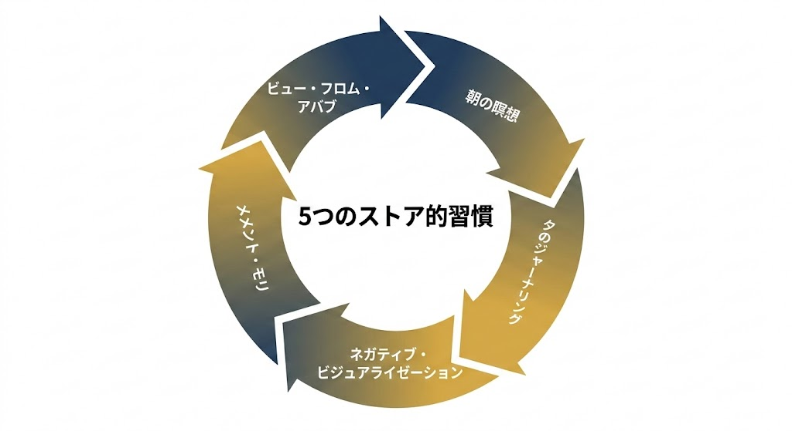{ width=100% }

知識は行動に変わったとき、初めて人生を変えます。第3章まででストア哲学の理論的な骨格を学びました。この章では、それを日常の習慣として定着させるための5つの実践を紹介します。どれも1回あたり5分から始められます。毎日完璧にこなす必要はありません。1つだけ選んで、まず1週間続けてみてください。

\newpage

### 4.1 朝の瞑想（Morning Reflection）

ストア哲学者たちは朝を、1日の哲学的準備の時間として大切にしました。マルクス・アウレリウスは皇帝でありながら、夜明け前に起き、自分の思考を整えてから1日を始めていたと伝えられています。

朝の瞑想の目的は「リラックスすること」ではありません。今日起こりうる困難を事前にイメージし、それに対してコントロール二分法を使っておくことです。これをストア哲学では「プレメディタティオ（事前の瞑想）」と呼びます。

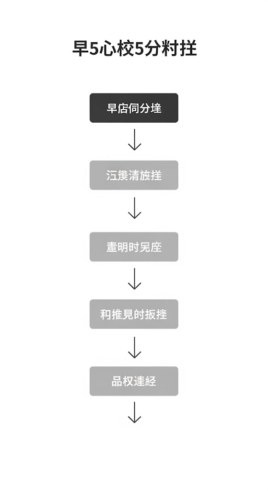{ width=100% }

具体的な5分プロトコルを紹介します。

まず、起床したらスマートフォンを手に取る前に座ります。ソファでも床でも、椅子でも構いません。目を閉じなくても大丈夫です。次に、今日のスケジュールを頭に思い浮かべます。会議、締め切り、会う人、やるべきタスク。

その中で「うまくいかないかもしれないこと」「気が重いこと」を1つか2つ選びます。たとえば「今日の14時に苦手なクライアントとの打ち合わせがある」としましょう。

そのシーンを頭の中でイメージしながら、第3章の仕分けをします。「クライアントが機嫌よく話を聞いてくれるかどうか」は支配外です。「自分が準備を万全にすること」「誠実に提案を説明すること」「どんな反応にも落ち着いて対応すること」は支配下です。

最後に、今日1日の意図を短く心の中で、または声に出して言います。「今日の私は、自分にできることに集中する」。この宣言は、1日を通じてアンカー（錨）になります。

なぜ朝が効果的かというと、朝はまだ外部の情報にさらされていないため、自分の内面に向き合いやすい状態です。SNSのニュース、メールの内容、職場の空気——こうした情報は、受け取った瞬間から感情に影響を与えます。朝の瞑想はその前に、今日の自分の「哲学的な立ち位置」を決める作業です。

最初は3分から始めても構いません。習慣として定着させることが最優先なので、内容よりも「毎日やること」を重視してください。

\newpage

### 4.2 夕の振り返りジャーナリング（Evening Journaling）

セネカは友人ルキリウスへの手紙の中で、毎晩眠る前に1日を振り返ることを強く勧めています。彼は「ピタゴラス派の伝統に倣い、私は毎晩、自分の言葉・行動・思考のすべてを点検する」と書きました。これが夕のジャーナリングの原型です。

夕のジャーナリングは自己批判の時間ではありません。自分の行動と思考を客観的に観察し、明日に生かすための振り返りです。セネカが提唱した3つの問いを基本として使います。

{ width=100% }

**問い1: 今日、何を誤ったか（うまくいかなかったか）**

「誤り」は失敗である必要はありません。「イライラして同僚に少しきつい言葉を使ってしまった」「会議中にスマホを何度も確認してしまった」「不安になって仕事が手につかなかった」——こうした小さな逸脱でも書き出します。大切なのは、それを書いた後に「では次はどうすればよかったか」と一言添えることです。

**問い2: 今日、何をうまくやれたか**

これは意外と難しい問いです。多くの人は問い1には次々と思い浮かぶのに、問い2では「特にない」と感じます。しかしストア哲学的には、「コントロールできないことに振り回されずに、できることに集中できた瞬間」はすべて記録する価値があります。「批判的なメールを受け取ったが、感情的にならずに返信できた」「プレゼンは緊張したが、準備したことを全部出し切れた」——こうした積み重ねが自己効力感を育てます。

**問い3: 明日、何を1つ改善できるか**

「すべてを改善しよう」ではなく、「1つだけ」という制約が重要です。欲張ると続きません。「明日の朝は上司への報告メールを読み直してから送る」「次の会議では発言を3回以上する」のように、小さく具体的に設定します。

具体的なシーンで言えば、夜10時にベッドに入る前の5分間、ノートかスマートフォンのメモアプリを開き、この3つの問いに箇条書きで答えるだけで十分です。書き言葉は「完璧な文章」でなくてよく、単語の羅列でも効果があります。重要なのは「毎晩同じ時間にやること」です。同じ時間・同じ場所・同じ行動——習慣化の鉄則はこの「文脈の固定」にあります。

\newpage

### 4.3 ネガティブ・ビジュアライゼーション（プレメディタティオ・マロルム）

「ネガティブなことを想像する」と聞くと、不安を増やしそうに思えるかもしれません。しかしストア哲学のネガティブ・ビジュアライゼーション（ラテン語で「悪いことの事前思索」）は、まったく逆の効果をもたらします。これは最も反直感的でありながら、最も効果的なストア的習慣のひとつです。

原理はシンプルです。「今あるものを失った状態を一時的にありありと想像することで、今あるものへの感謝と充足感が増す」。

{ width=100% }

たとえば、毎日一緒に働いている同僚の存在を「当たり前」と感じていませんか。今夜、目を閉じて、その人が明日から会社を辞めてしまった状況をリアルに想像してみてください。どんな仕事の場面が困るか、どんな会話がなくなるか、どれほど自分が助けてもらっていたかを具体的にイメージします。5分後に目を開けたとき、その人への感謝の気持ちが戻ってきているはずです。

もう一つの具体的な実践例を紹介します。毎朝コーヒーを飲んでいる方は、「このコーヒーが今日から飲めなくなったら」と想像してみましょう。カフェインへの依存という意味ではなく、「当たり前の喜び」に気づくためです。これだけで、今日の1杯がいつもより豊かに感じられます。

職場での応用として特に効果的な場面があります。仕事がうまくいかない時期、「この仕事は自分に合っていない」「もっと良い仕事があるはずだ」という気持ちに囚われることがあります。そこでネガティブ・ビジュアライゼーションを使います。「もし明日から仕事がなくなったら」と想像するのです。収入、社会的なつながり、毎日のルーティン、スキルを磨く場——それらが一気になくなった状態をリアルに思い浮かべます。すると多くの場合、「今の仕事にも価値があった」という認識が戻ってきます。

注意点が1つあります。これは「現状に満足していれば変化を求めなくていい」という意味ではありません。転職したい、違う働き方を目指したいという欲求は正当です。ただ、その欲求を「今あるものへの不満」から動機にするのではなく、「より良い選択をする」という積極的な意志から動かせるようになる——そのリセットボタンとして使うのが正しい使い方です。

\newpage

### 4.4 メメント・モリ — 死を忘れるな

「死を考えろ」というメッセージは、現代人にとって不快に響くかもしれません。しかしストア哲学において、メメント・モリ（「死を忘れるな」のラテン語）は恐怖を煽るためではなく、**今この瞬間の優先順位を明確にするため**の実践です。

マルクス・アウレリウスは「哲学するとは死に備えることだ」という言葉を残しています。彼はローマ帝国最大版図を統治する皇帝でありながら、毎日の思索ノート（現在の「自省録」）の中で繰り返し、自分の死と有限性について書き記しました。

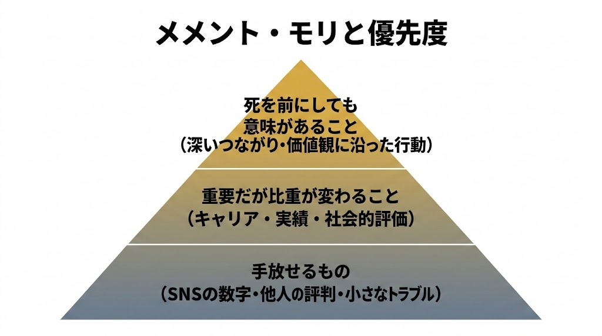{ width=100% }

5分でできるメメント・モリの実践を紹介します。

週に一度、静かな場所で次の問いに答えてみてください。「もし今日が最後の日だとしたら、今日1日をどう使いたいか」。これは「やりたいことをすべて今すぐやれ」という意味ではありません。むしろ「今週の自分の時間の使い方は、本当に自分が大切にしていることと一致しているか」を確認するための問いです。

あるビジネスパーソンの例を紹介します。毎日残業が続き、家族と話す時間がほとんどない状況でした。「今日が最後の日だとしたら」と問うと、会社の目標数値よりも子どもとの夕食の方が重要だという答えが即座に出てきました。これは「仕事をやめろ」という意味ではなく、「今の時間配分を再考する」きっかけになりました。翌週から彼は週2回、どんなに仕事が忙しくても19時には退社する日を設けました。

もう一つの実践として、「10年後のリグレット・テスト」があります。10年後の自分が今日を振り返ったとき、「あの時もっとこうすればよかった」と後悔しそうなことは何かを考えます。こうした将来の後悔を事前にイメージすることで、今日の行動を変えるきっかけになります。これもまたメメント・モリの一形態です。

メメント・モリは「死を怖がれ」ではなく「今を大切にしろ」というメッセージです。有限であることを認識したとき、人は不必要なことに費やすエネルギーを本当に大切なことへ向け直すことができます。セネカはこう書きました。「すべての時間を所有するように生きよ。人生を、そのすべての時間を通じて生きよ」と。

\newpage

### 4.5 ビュー・フロム・アバブ — 宇宙から自分を見る

マルクス・アウレリウスが「自省録」の中で繰り返し用いた瞑想法があります。それが「ビュー・フロム・アバブ（上からの眺め）」です。自分が今いる場所から意識をどんどん高く引き上げ、街、国、地球、太陽系、宇宙——というスケールで俯瞰することで、日常の悩みを相対化する技法です。

マルクスはこう書きました。「高い場所に立って下を見よ。どれほど多くの人の群れ、どれほど多くの儀式、どれほど多くの嵐と凪の航海が見えることか。かつてあったもの、今あるもの、これからあるものの多様さを見よ」。

{ width=100% }

具体的な5分プロトコルです。

静かな場所に座り、目を閉じます。まず今いる場所を意識します。自分の部屋、オフィスの席、その建物。次に、そこから少しずつ視点を上に引き上げます。自分が働いているビルのある街を鳥のように上空から見る。さらに上に引き上げると、日本列島が小さく見えます。さらに上がると、地球が青い球として見えます。宇宙空間から地球を眺めると、そこには今あなたが悩んでいる職場も、気になっているSNSも、すべて一点の小さな点の上にあります。

その状態で、今悩んでいることを一度思い浮かべてください。「部長に評価されなかった」「SNSのコメントが気になる」「プロジェクトがうまくいっていない」。宇宙のスケールから見たとき、それはどのくらいの大きさに感じますか。

注意すべき誤解があります。ビュー・フロム・アバブは「どうせ宇宙から見れば何もどうでもいい、だから頑張らなくていい」という虚無感を目的としていません。逆です。マルクス・アウレリウス自身は、宇宙的視点を持ちながらも、皇帝としての責務をこれ以上ないほど真剣に果たしました。宇宙のスケールを知ることで、「だから今この瞬間、目の前のことに誠実に向き合おう」という逆説的な集中が生まれるのです。

あるエンジニアの例を紹介します。リリース直前のシステムにバグが見つかり、深夜まで修正作業が続きました。パニック状態になりながらも、彼はトイレに立ったとき、窓から夜空の星を30秒だけ眺めたといいます。「この宇宙の中で、今私はコードを書いている」と思ったとき、不思議とパニックが収まり、集中力が戻ってきました。ビュー・フロム・アバブは、こうした緊張の極限状態でも使える応急処置としての効果があります。

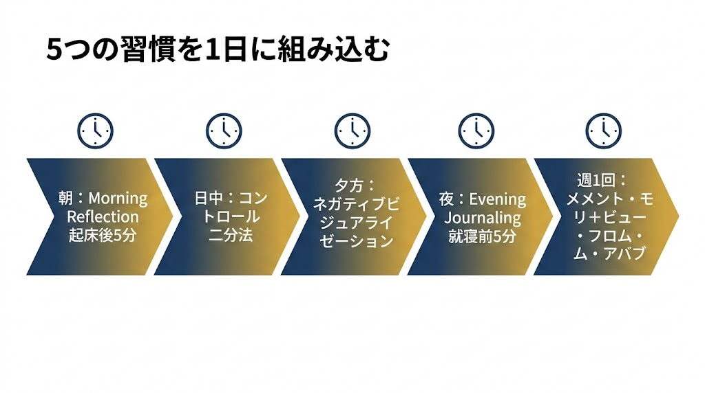{ width=100% }

5つの習慣を一度にすべて始める必要はありません。「どれか1つ選ぶとしたら」という問いに答えるなら、朝の瞑想から始めることをお勧めします。1日の始まりにコントロール二分法を使う習慣がつくだけで、その日の感情の揺れ方が変わってきます。1つが定着したら、夕のジャーナリングを加え、少しずつ5つを日常に組み込んでいきましょう。

ストア哲学の実践は、完璧にやることではなく、毎日少しずつ「気づいて、仕分けて、行動する」サイクルを回すことです。2000年前のローマの哲学者たちも、完璧な賢者ではありませんでした。彼らは毎日書き、問い、失敗し、また書いた。その積み重ねが、今もなお読まれ続ける言葉を生みました。あなたの毎日の5分も、やがて人生の重心を変えていきます。

\newpage

## 第5章 ストア哲学を「今日から」始めるために

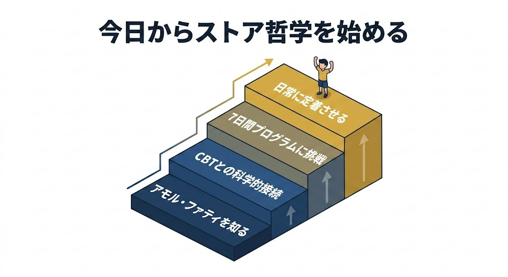{ width=100% }

ここまでの4章で、ストア哲学の全体像、三哲人の生涯、コントロール二分法、そして5つの習慣を学んできました。最終章では、これらすべてを「今日から」の行動に落とし込みます。最後に紹介する2つの概念と、1週間で体感できるプログラムを用意しました。

\newpage

### 5.1 アモル・ファティ — 運命を愛せ

ストア哲学の中でも最も誤解されやすく、同時に最も深い概念が「アモル・ファティ（運命を愛せ）」です。

「運命を受け入れろ」と聞くと、多くの人が「それは諦めと何が違うのか」と感じるでしょう。その疑問はもっともです。しかしアモル・ファティは「受け入れる」の一歩先にあります。起きたことを嫌々受け入れるのではなく、**起きたことを「これで良かった」と積極的に肯定する**姿勢です。

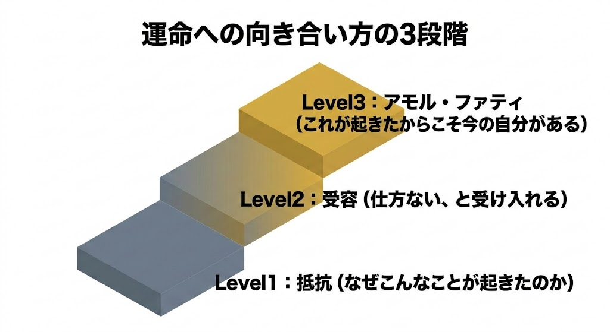{ width=100% }

ゼノンの例を思い出してください。彼は嵐で全財産を失いました。それを「仕方ない」と受け入れるのが受容です。しかしゼノンは後にこう語ったと伝えられています。「私が難破して最も有益な航海をしたのは、すべてを失った時だった」。財産を失ったからこそ哲学に出会い、人生が根本から変わった。それが「起きたことを愛する」ということです。

現代の私たちの生活でも、同じ構造を見つけることができます。たとえば、希望していた部署に配属されず、まったく興味のない部門に回されたとします。最初は失望と怒りを感じるでしょう。しかし3年後に振り返ると、その部門で得た経験が自分のキャリアにとって決定的に重要だった——そういう経験をした人は少なくありません。

アモル・ファティは「すべてがうまくいく」というポジティブ思考ではありません。「起きたことから最大の学びと成長を引き出す」という能動的な姿勢です。出来事そのものは変えられませんが、その出来事をどう「使う」かは完全に自分の支配下にあります。

\newpage

### 5.2 認知行動療法（CBT）との接続 — 科学が証明したストア哲学

ストア哲学は「古い教え」だから時代遅れだと思われるかもしれません。しかし実は、現代の心理療法の主流である認知行動療法（CBT）は、ストア哲学を直接の源流としています。

CBTの創始者アルバート・エリスは、自身の理論がエピクテトスの教えに基づいていることを明言しました。もう一人の創始者アーロン・ベックも、認知療法の基本原理がストア哲学と同じ構造であることを認めています。

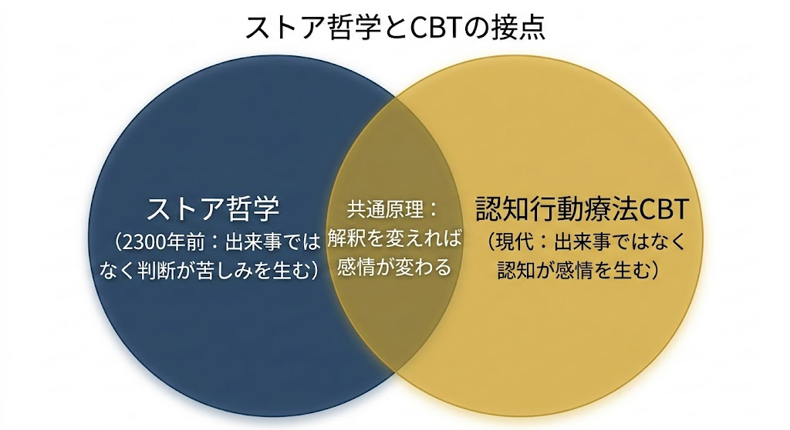{ width=100% }

その核心的な共通点はこうです。

- ストア哲学: 「われわれが苦しむのは、ものごとそのものによってではなく、ものごとについてのわれわれの判断によってである」（エピクテトス）
- CBT: 「感情は出来事そのものではなく、出来事についての認知（解釈）によって生じる」（アーロン・ベック）

ほぼ同じことを言っています。つまりストア哲学の実践は、科学的に効果が検証された心理療法と同じ構造を持っているのです。

CBTでは「認知の歪み」を特定して修正するワークを行いますが、これはストア哲学の「コントロール二分法」と「アパテイア」の実践とほぼ同じです。「上司に怒鳴られた→私はダメな人間だ」という認知の飛躍を、「上司が怒鳴った（事実）→私の企画書に改善点がある（解釈の修正）→具体的に何を直すか考える（行動）」と修正していく。コントロール二分法を使った仕分けと、本質的に同じプロセスです。

このことが意味するのは、ストア哲学の実践は「スピリチュアル」でも「根性論」でもなく、科学的な根拠に支えられた心のケア技術だということです。哲学と科学が同じ答えにたどり着いた——これは、ストア哲学の教えが人間の心の普遍的な構造を捉えていることの証拠です。

\newpage

### 5.3 7日間プログラム — 今日から始める1週間

最後に、本書で学んだことを1週間で体験するためのプログラムを紹介します。完璧にこなす必要はありません。「やってみる」こと自体が、ストア哲学の実践です。

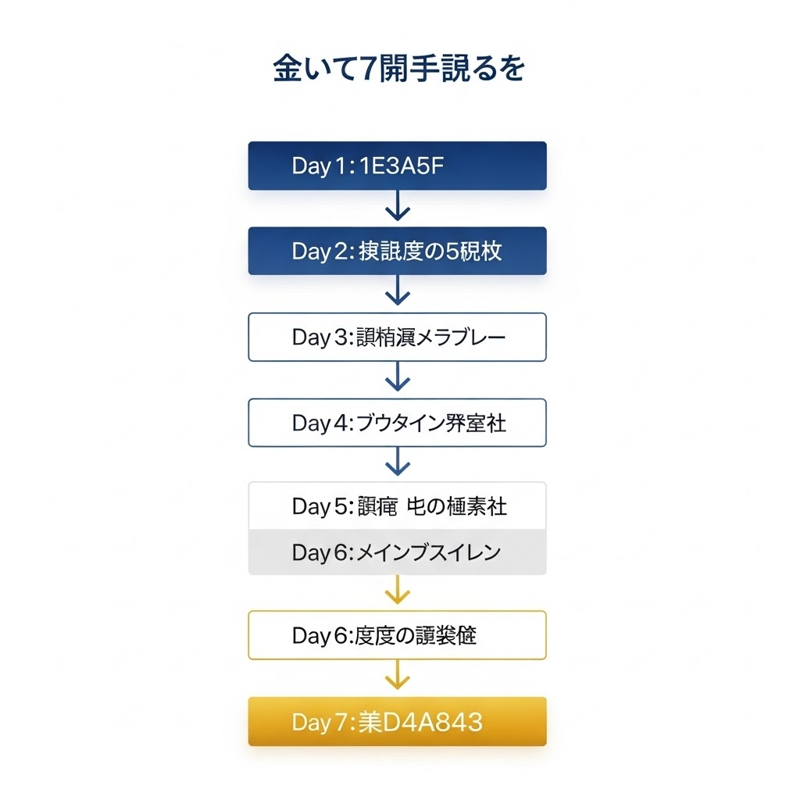{ width=100% }

**Day 1: コントロール二分法ワークシート**

第3章の3.4節で紹介した3ステップを実践します。今抱えている悩みをすべて書き出し、「支配下」と「支配外」に仕分け、支配下の項目からアクションリストを作ります。所要時間は10〜15分です。

**Day 2: 朝の瞑想**

起床後、スマートフォンを見る前に5分間座って、今日起こりうる困難をイメージし、コントロール二分法で仕分けます。最後に「今日は自分にできることに集中する」と宣言して1日を始めます。

**Day 3: 夕のジャーナリング**

就寝前の5分間、セネカの3つの問い——「何を誤ったか」「何をうまくやれたか」「明日、何を1つ改善できるか」——に答えます。ノートでもスマートフォンのメモでも構いません。

**Day 4: ネガティブ・ビジュアライゼーション**

今あなたの生活の中で「当たり前」になっているもの——仕事、健康、家族、友人——のうち1つを選び、それが突然なくなった状態を5分間リアルに想像します。終わった後、どんな感情が湧いたかを記録してください。

**Day 5: メメント・モリ**

「もし今日が最後の日だとしたら、今日1日をどう使いたいか」を紙に書き出します。そして、今週の自分の時間の使い方がその答えと一致しているかどうかを確認します。

**Day 6: ビュー・フロム・アバブ**

静かな場所で5分間、自分→街→日本→地球→宇宙とスケールを上げていく瞑想を行います。宇宙から地球を眺めた状態で、今の悩みを思い浮かべ、その大きさがどう感じるかを観察します。

**Day 7: 振り返りと選択**

この1週間で試した6つの実践の中から、「自分に最も合っている」と感じたものを1つか2つ選びます。それを来週以降も毎日続けてみてください。ストア哲学者になるために6つすべてをやる必要はありません。1つでも続けることに意味があります。

\newpage

## おわりに

本書を最後まで読んでくださり、ありがとうございます。

この本を通じてお伝えしたかったことは、たった一つです。**ストア哲学は、2000年以上の時を超えて、今のあなたの悩みに直接使える「実践の哲学」である**ということです。

奴隷のエピクテトスは、すべてを奪われた境遇の中で内面の自由を見つけました。政治家のセネカは、権力と矛盾の渦中で毎晩自分を振り返り続けました。皇帝マルクス・アウレリウスは、戦場のテントの中で自分の有限性と宇宙の広大さを思索し続けました。

三人に共通するのは、**完璧な賢者ではなかった**ということです。エピクテトスも弟子に厳しすぎると批判されることがありました。セネカは莫大な富を持ちながら「質素に生きよ」と説く矛盾を指摘されました。マルクスは朝起きるのが辛いと正直に日記に書きました。

それでも彼らは、毎日書き、問い、失敗し、また立ち上がった。完璧でなくても、哲学を手放さなかった。その姿こそが、私たちの手本です。

本書で紹介したコントロール二分法、5つのストア的習慣、アモル・ファティ、7日間プログラム——どれか1つでも「やってみよう」と思っていただけたなら、この本は役目を果たしたことになります。

明日の朝、スマートフォンを手に取る前に、5分だけ座ってみてください。今日起こりうる困難を思い浮かべ、「自分にできることは何か」と問いかけてみてください。その5分が、あなたのストア哲学の第一歩です。

完璧なストア哲学者になる必要はありません。毎日少しずつ、「気づいて、仕分けて、行動する」——そのサイクルを回し続けるだけで十分です。2000年前のローマの哲学者たちが残してくれた知恵が、あなたの毎日を少しだけ軽くしてくれることを願っています。
